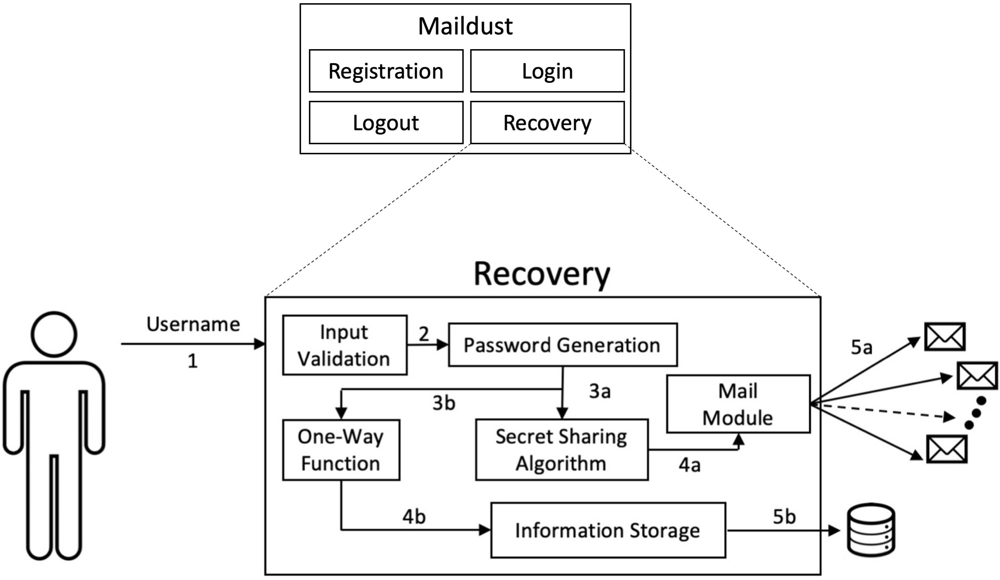

**Author:** *[Simone Raponi](https://github.com/SimoneRaponi)

**Date:**   *March 11, 2020*

# MailDust

MailDust is an open-source, innovative solution to password recovery that is, by design, resistant to mail-service provider attacks.
As shown in the comparison table below, MailDust does not impact negatively on the usability and, therefore, on the user experience.

  

### Server

Given the modularity of the code and the possibility to easily integrate it in each Website, we decided to implement the Maildust server module inside a Docker container. 
Containers technology, providing near bare-metal performance with respect to virtualization, is becoming a standard approach to distribute applications, allowing to run multiple versions of applications on the same machines.
The Maildust Webserver has been implemented over Flask microframework, while for applying Shamir’s secret sharing scheme we relied on the open-source code https://github.com/blockstack/secret-sharing.
In the following, a graphical representation of the MailDust module is depicted, with a zoom in the password recovery process.

  

#### Requirements for installing the server
 - Docker

### Client

The client module has been implemented in Python 3.6 language, adopting libraries useful to manage the reading of received e-mails, such as imaplib3 and email.

  

#### Requirements for installing the client
 - Python 3.x
